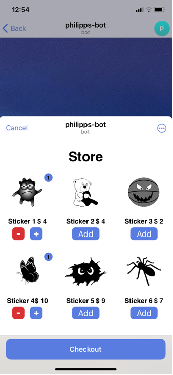
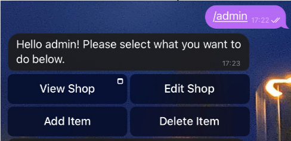

# Philipps-telegram-bot

Telegram bot that uses the new built-in Web App feature to make a simple shop front, with a simple CRUD interface.

After items are chosen, user is sent an invoice, using Stripe's test payment API, if purchase is successful, information on sale is sent to a groupchat(need to add bot to the gc).

Before launching make .env file with the following:
BOT_TOKEN = (from @botfather)
ADMIN_ID = (telegram user id)
PROVIDER_TOKEN = (stripe test token)
GC = (group chat id)

```
npm start
```

in another terminal tab, for demonstation i use _ngrok_:

launch index.php and then use ngrok's ` ngrok http http://localhost:_PORT_`, (might need to add /webapp/index.php to the URL)copy the ngrok link over to ./buttons.js const WebAppLink



